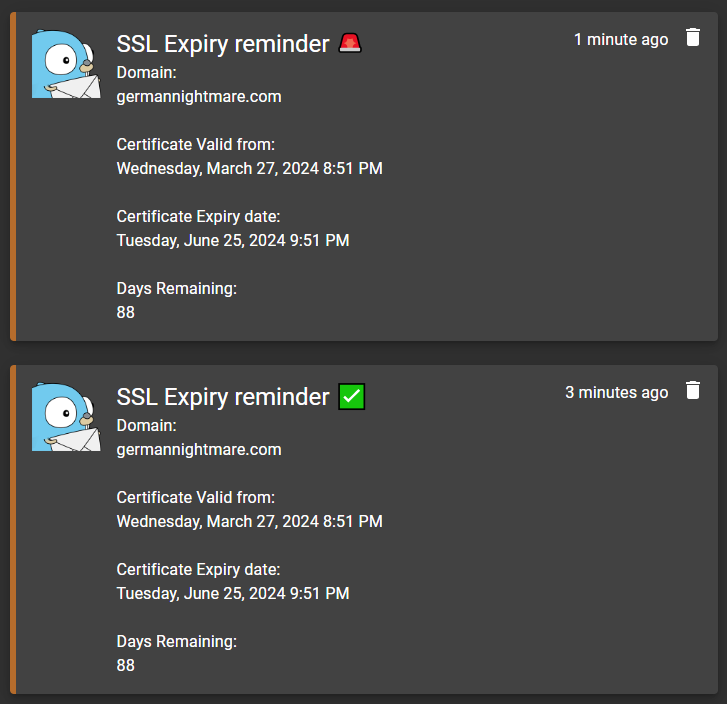
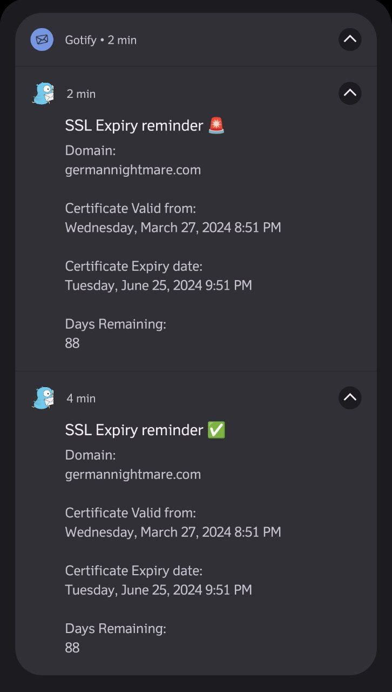
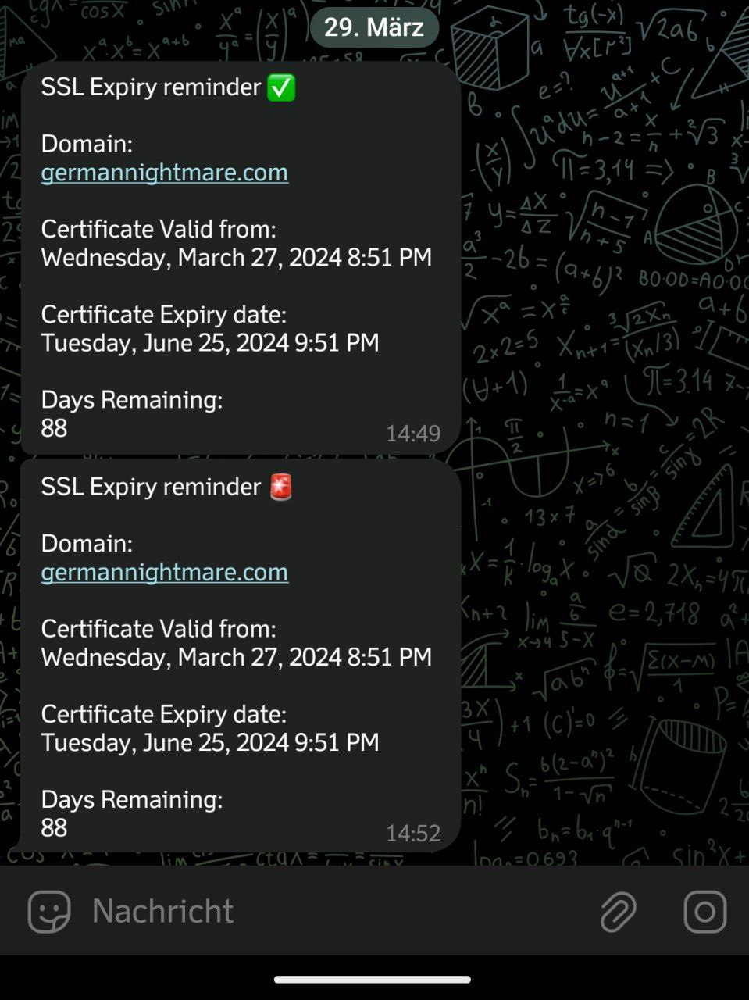

# SSL Expiry Reminder Dockerized 🐳🔔 
### Forked from: [mskian/ssl-expiry-reminder](https://github.com/mskian/ssl-expiry-reminder)

SSL Expiry Reminder and SSL Status Checker Dockerized 🐳 - Get SSL Expiry Notification reminder on Telegram and Gotify.  

## Gotify  
### Desktop
  

### Smartphone
  

## Telegram  

  

## ⚙ Requirements
- Server with Docker
- Telegram Bot Token (optional) - <https://core.telegram.org/bots>
- Gotify API Token (optional) - <https://gist.github.com/mcnaveen/2788985648490e7b3af24647247ed4e7#gistcomment-2996497>

## 🔧 Installation (docker) 🐳
Tip: If you don't want to have Telegram, for example, simply delete the line or in the compose variant comment it out with '#'

- Run via `docker run via docker hub image`
```bash
docker run -d \
    --name ssl_checker_01 \
    -e DOMAINS="domain1.com,domain2.com" \
    -e TELGRAM_TOKEN="your_telegram_token" \
    -e TELGRAM_CHAT_ID="your_telegram_chat_id" \
    -e GOTIFY_TOKEN="your_gotify_token" \
    -e GOTIFY_DOMAIN="your_gotify_domain" \
    -e REMAINDER_DAYS_TO_EXPIRE="7" \
    -e CHECKING_INTERVAL_IN_DAYS="7" \
    schecher/ssl-expiry-reminder:latest
```

- Run via `docker compose via docker hub image`
```yaml
version: '3'
services:
  sslchecker:
    container_name: ssl_checker_01
    image: schecher/ssl-expiry-reminder:latest
    environment:
      - DOMAINS=domain1.com,domain2.com
      - TELGRAM_TOKEN=your_telegram_token
      - TELGRAM_CHAT_ID=your_telegram_chat_id
      - GOTIFY_TOKEN=your_gotify_token
      - GOTIFY_DOMAIN=your_gotify_domain
      - REMAINDER_DAYS_TO_EXPIRE=7
      - CHECKING_INTERVAL_IN_DAYS=7
```

- Run via `docker run via source code`
```bash
git clone https://github.com/mskian/ssl-expiry-reminder.git

cd ssl-expiry-reminder

docker build -t sslreminder .

docker run -d \
    --name ssl_checker_01 \
    -e DOMAINS="domain1.com,domain2.com" \
    -e TELGRAM_TOKEN="your_telegram_token" \
    -e TELGRAM_CHAT_ID="your_telegram_chat_id" \
    -e GOTIFY_TOKEN="your_gotify_token" \
    -e GOTIFY_DOMAIN="your_gotify_domain" \
    -e REMAINDER_DAYS_TO_EXPIRE="7" \
    -e CHECKING_INTERVAL_IN_DAYS="7" \
    sslreminder
```

- Run via `docker compose via source code`
```bash
git clone https://github.com/Schecher1/SSL-Expiry-Reminder-Docker.git

cd SSL-Expiry-Reminder-Docker

nano docker-compose.yaml  [to edit the env vars]

docker compose up -d
```

## 📖 Library

SSL Checker NPM Module - <https://github.com/mskian/ssl-checker-node-api>

## 🏗 Contributions


If you have a PR, submit it here... Your PR is always welcome 🐳💻 __[My Repo]__  
[Click here](https://github.com/Schecher1/SSL-Expiry-Reminder-Docker/pulls)

## 🐛 Bug Report

If you find any issues create an issue Ticket Here ✉📫  __[Owner Repo]__  
[Click here](https://github.com/mskian/ssl-expiry-reminder/issues)

## ✅ License

- MIT

## 📃 Changelog

## v1.0.1.1
- Bug Fix: No endless loop was added, the container would have stopped after the "second" search

### v1.0.1.0
- Docker image size was optimized by 66,6% (370mb => 123mb)

### v1.0.0.0
- Docker support was added
- Message has been edited (clearer)